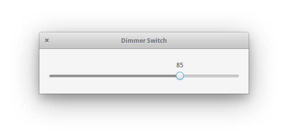

 # Dimmer Switch

 <i>Brightness Adjustment for Linux, written in Vala</i>

 

 Instead of adjusting the backlight, this app uses `xrandr` to change the brightness of the image displayed on your screen. This can be useful for displays without an adjustable backlight, displays with a too-bright minimum backlight, or OLED displays.

<!--
 ## install from AppCenter
 On elementaryOS simply install Dimer Switch from AppCenter:
 

   
 

 ### OR

 ## build it and install it with Meson
 :)
-->

 ## Credits
 
Icons made by <a href="http://www.freepik.com" title="Freepik">Freepik</a> from <a href="https://www.flaticon.com/" title="Flaticon">www.flaticon.com</a> (Licensed by <a href="http://creativecommons.org/licenses/by/3.0/" title="Creative Commons BY 3.0" target="_blank">CC 3.0 BY)</a>

